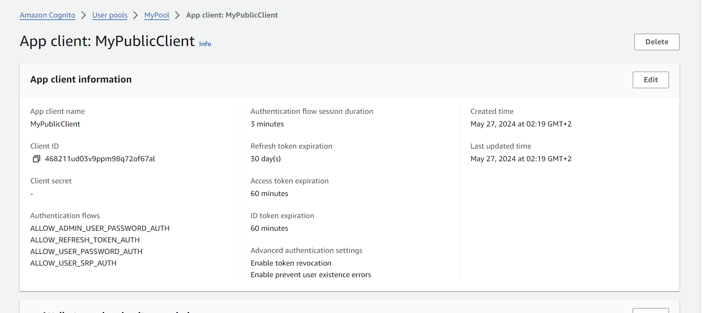
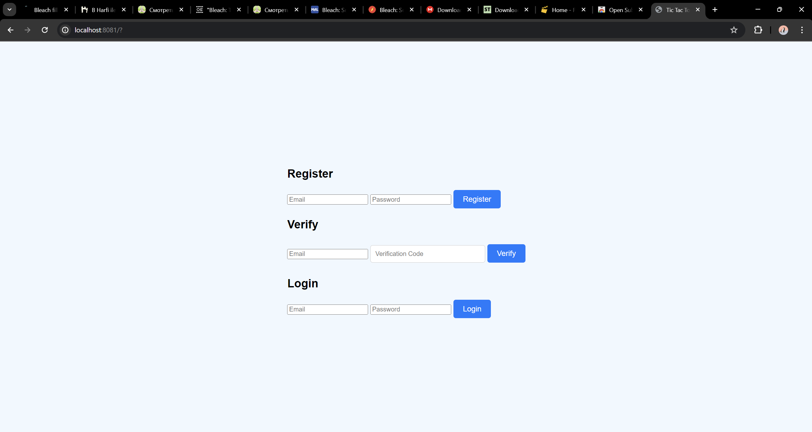
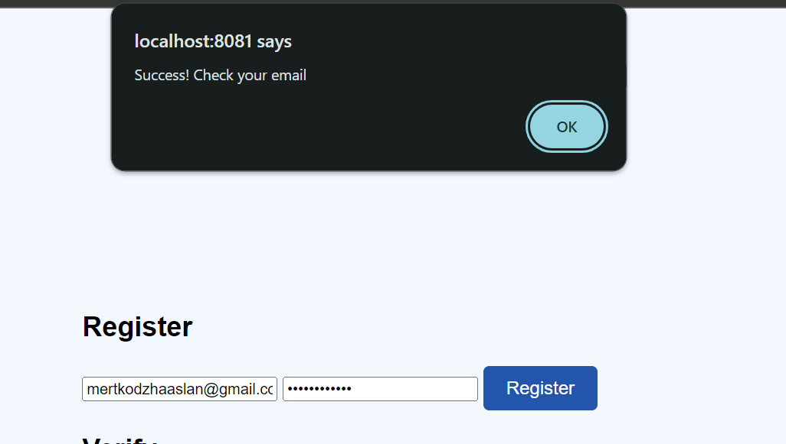
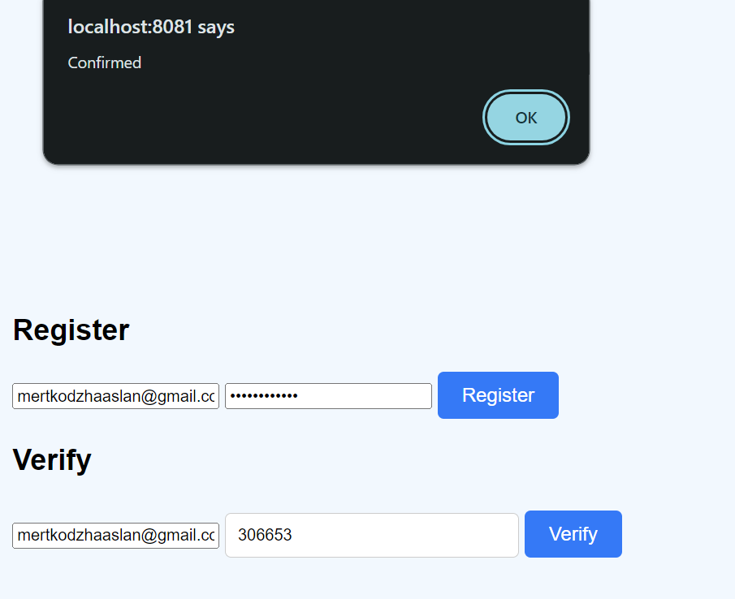

Here's the updated README file focused on the AWS Cognito integration, written in simple and clear language:

# Mert Nuri Kodzhaaslan - TicTacToe with AWS Cognito

- **Course**: Cloud Programming
- **Group**: 3
- **Date**: 27 05 2024

## Environment Architecture

This project is a TicTacToe game application that uses AWS Cognito for user authentication and authorization.

## Preview

## Reflections

### What Did You Learn?
- I learned how to use AWS Cognito to manage user authentication and authorization.
- I learned how to set up and deploy a secure application in AWS.
- I also learned how to add authentication and authorization using AWS Cognito.

### What Obstacles Did You Overcome?
- I had problems with fixing Docker Compose.
- I fixed the backend and its template.
- I integrated AWS Cognito for user authentication and authorization.

### What Helped You Most in Overcoming Obstacles?
- Referring to AWS documentation and examples helped a lot.
- Practical experience and trying out different solutions were key to overcoming the obstacles.

### Was There Something That Surprised You?
- I was surprised by how easy and powerful AWS Cognito is for managing user authentication.
- I was also impressed with how AWS Cognito simplifies adding user authentication and authorization.

## AWS Cognito Integration

### Backend Changes
- Added dependencies for AWS SDK and JSON Web Tokens (JWT).
- Created an authentication service using AWS SDK to verify user data with Cognito.
- Defined endpoints that require authorization.

### Frontend Changes
- Configured the AWS SDK to connect with the user pool in AWS Cognito.
- Created separate registration, verification, and login forms.
- After successful login, access and refresh tokens are saved in localStorage.
- Added logic to refresh the access token automatically when needed.
- Implemented frontend logic to add access tokens to requests sent to the backend.
- Added a logout function that clears session data and notifies Cognito to end the session.

